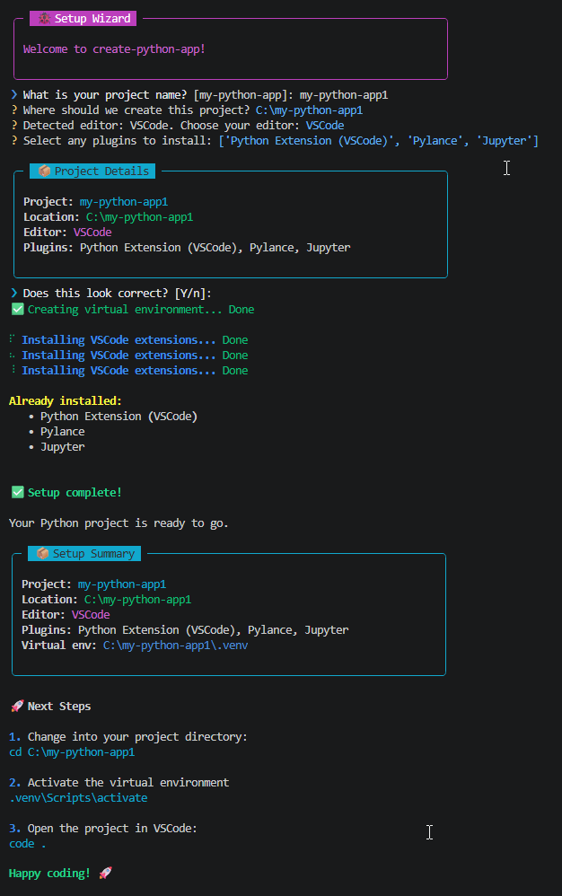

<p align="center">
    
    <h3 align="center">Build. Code. Launch.</h3>
</p>


 
 

create-python-app is a guided command-line wizard that helps developers create new Python projects in minutes.

It creates a clean project structure, sets up a virtual environment, and can install recommended editor extensions to help you start coding quickly.


## Screenshot




## Why create-python-app?

Starting a new Python project often means repeating the same setup steps:

- Creating a project structure
- Creating and configuring a virtual environment
- Choosing and configuring an editor
- Installing recommended tooling and extensions
- Setting up a solid foundation before writing any code

While there are many excellent project generators available, create-python-app takes a deliberately simple approach.

The goal isn't to generate every possible type of application, framework, or architecture. Instead, it focuses on helping developers get from:

> "I have an idea."

to

> "I'm writing code."

as quickly as possible.

create-python-app provides a guided setup experience with sensible defaults, editor-aware configuration, and a workflow designed to help you start building immediately.

### Design Principles

create-python-app is built around a few simple ideas:

- **Simple by default** - sensible defaults should require minimal configuration.
- **Guided, not overwhelming** - users should not need to understand dozens of options before getting started.
- **Editor-aware** - the setup experience should adapt to the tools you use.
- **Beginner-friendly** - useful for developers of all experience levels.
- **Practical foundations** - start with a clean project structure and modern development practices.
- **Focused on productivity** - spend less time configuring and more time building.

The aim is simple:

> Ask a few questions, create a solid foundation, and get out of your way.


## Features

✅ Guided setup wizard

✅ Automatic virtual environment creation

✅ Optional editor extension installation

✅ Support for VS Code, Cursor, PyCharm and Vim

✅ Beginner-friendly defaults

✅ Clear next-step guidance after project creation


## Who is this for?

create-python-app is ideal for:

- Developers starting new Python projects
- Students learning Python
- Developers who want a quick, repeatable setup process
- Anyone who prefers sensible defaults over extensive configuration


## Platform Support

Currently tested on Windows ✅

Future releases aim to support:

- Linux
- macOS


## Installation

### PyPI

```bash
pip install create-python-app
```

### pipx

```bash
pipx install create-python-app
```

---

## Quick Start

Create a new project:

```bash
create-python-app
```

The wizard will guide you through:

- Choosing a project name
- Selecting a project location
- Choosing an editor
- Installing optional extensions
- Creating a virtual environment

---

## Example

```text
❯ What is your project name?
my-python-app

❯ Where should we create this project?
C:\Projects\my-python-app

❯ Choose your editor
VS Code

❯ Select any plugins to install
✓ Python Extension (VSCode)
✓ Pylance
```

Result:

```text
my-python-app/
│
├── .venv/
├── docs/
├── src/
├── tests/
├── README.md
└── pyproject.toml
```

---

## Supported Editors

- VS Code
- Cursor
- PyCharm
- Vim
- Other

---

## Documentation

Full documentation is available at:

https://create-python-app.dev

---

## Roadmap

See [ROADMAP.md](ROADMAP.md) for upcoming features and planned improvements.

---

## Contributing


Contributions, bug reports, feature requests and feedback are welcome.

Please open an issue or discussion on GitHub.

For development guidelines, coding standards and Conventional Commit requirements, see:

- [Contributing Guide](docs/contributing.md)

---

## License

MIT License

See `LICENSE` for details.